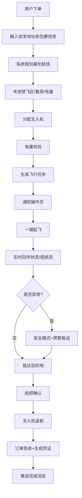
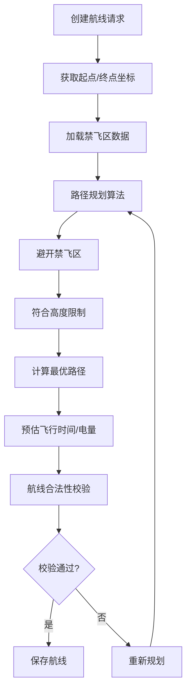

# 无人机快递配送调度平台 - 产品需求文档

## 1. 产品概述

无人机快递配送调度平台是一个面向现代物流行业的智能调度系统，旨在通过自动化无人机配送提升物流效率。平台支持用户、无人机操作员、调度员和管理员四种角色协同工作，实现从下单到签收的全流程智能化管理。

- **核心价值**：通过AI航线规划、实时监控和智能调度，大幅缩短配送时间，降低运营成本
- **目标用户**：电商平台、物流企业、无人机运营团队、终端用户

## 2. 核心功能

### 2.1 用户角色

| 角色 | 注册方式 | 核心权限 |
|------|----------|----------|
| 普通用户 | 手机号/邮箱注册 | 下单、查看订单、下载签收凭证、接收消息提醒 |
| 无人机操作员 | 管理员邀请注册 | 无人机管理、一键起飞、飞行监控、异常处理、返航操作 |
| 调度员 | 管理员邀请注册 | 实时监控所有无人机、查看航线、生成/查看运力统计报告 |
| 管理员 | 系统初始化创建 | 用户管理、禁飞区设置、飞行高度限制、系统配置、航线校验规则管理 |

### 2.2 功能模块

1. **用户端**：首页、下单页面、订单列表、订单详情、个人中心
2. **操作员端**：无人机管理、任务列表、飞行控制、实时监控面板
3. **调度员端**：全局地图监控、无人机状态面板、运力统计报告
4. **管理员端**：用户管理、禁飞区管理、飞行规则配置、系统日志

### 2.3 页面详情

| 页面名称 | 模块名称 | 功能描述 |
|-----------|-------------|---------------------|
| 登录页 | 角色选择登录 | 支持四种角色登录，记住登录状态，忘记密码 |
| 用户首页 | 快速下单入口 | 地址管理、历史订单快捷下单、热门配送服务展示 |
| 下单页 | 订单创建 | 收发件地址输入、包裹信息填写、预估费用、自动航线预览 |
| 订单列表 | 订单管理 | 按状态筛选、搜索、分页展示、订单状态跟踪 |
| 订单详情 | 订单信息 | 物流轨迹、飞行航线、签收凭证下载、异常记录 |
| 操作员面板 | 无人机管理 | 无人机列表、状态监控、电量管理、维护记录 |
| 飞行控制 | 任务执行 | 一键起飞、实时视频流、飞行参数调节、紧急降落 |
| 调度中心 | 全局监控 | 地图实时显示所有无人机位置、状态、航线 |
| 统计报告 | 数据报表 | 每日运力统计、配送成功率、异常分析、趋势图表 |
| 禁飞区管理 | 区域配置 | 多边形区域绘制、高度限制、生效时间设置 |
| 系统配置 | 管理员功能 | 用户管理、角色权限、参数配置、操作日志 |

## 3. 核心流程

### 3.1 下单配送流程

用户填写配送信息 → 系统根据地址/载荷/禁飞区自动规划最优航线 → 分配可用无人机 → 校验电量充足 → 生成飞行任务 → 通知操作员 → 操作员一键起飞 → 实时回传飞行状态和视频流 → 异常时自动切换安全模式并推送预警 → 抵达目的地拍照确认 → 无人机返航 → 系统更新订单状态为已签收 → 生成签收凭证 → 推送完成消息

### 3.2 Mermaid 流程图

### 3.3 航线规划与禁飞区校验流程

## 4. 用户界面设计

### 4.1 设计风格

**设计理念**：科技感与功能性并重，采用工业级科技美学风格，强调数据可视化和实时监控能力。

- **主色调**：深空蓝 `#0F172A` 作为背景主色，体现科技感和专业感
- **强调色**：航空蓝 `#3B82F6` 用于主要操作按钮和状态指示
- **成功色**：翡翠绿 `#10B981` 表示正常状态和成功操作
- **警告色**：琥珀橙 `#F59E0B` 用于预警和注意事项
- **危险色**：赤红 `#EF4444` 用于异常状态和危险操作
- **中性色**： slate 系列灰度，用于文本和边框

- **按钮风格**：直角硬朗边框，微悬浮效果，点击反馈，状态指示灯
- **字体**：标题使用 `Orbitron` 体现科技感，正文使用 `Inter` 保证可读性
- **布局风格**：栅格化仪表盘布局，模块化卡片设计，实时数据流展示
- **图标风格**：线性图标 `lucide-react`，状态指示采用发光效果

### 4.2 页面设计概述

| 页面名称 | 模块名称 | UI 元素 |
|-----------|-------------|-------------|
| 登录页 | 登录表单 | 深色渐变背景、角色选择卡片、动态粒子效果、玻璃拟态表单 |
| 操作员面板 | 飞行监控 | 实时地图、视频流窗口、HUD风格数据面板、状态指示灯、操作杆控件 |
| 调度中心 | 全局监控 | 大屏地图、无人机集群标记、航线轨迹、状态统计看板、预警通知栏 |
| 下单页 | 表单设计 | 地址自动补全、包裹参数滑块、航线预览地图、费用实时计算 |
| 统计报告 | 数据可视化 | 多种图表类型、时间筛选、数据导出按钮、趋势分析卡片 |
| 禁飞区管理 | 地图交互 | 多边形绘制工具、区域属性表单、颜色区分禁飞等级、时间轴配置 |

### 4.3 响应式设计

- **桌面优先**：设计针对大屏幕监控场景优化，支持多窗口布局
- **平板适配**：侧边栏可收起，内容区域自适应缩放
- **移动端**：核心功能保留，采用底部导航，简化操作流程
- **触控优化**：按钮最小尺寸 44x44px，手势操作支持

### 4.4 实时数据展示

- 无人机位置刷新频率：1秒/次
- 飞行状态数据：高度、速度、电量、信号强度实时更新
- 消息推送：WebSocket 实时推送，桌面通知
- 视频流：低延迟 HLS 播放，支持多画面切换
