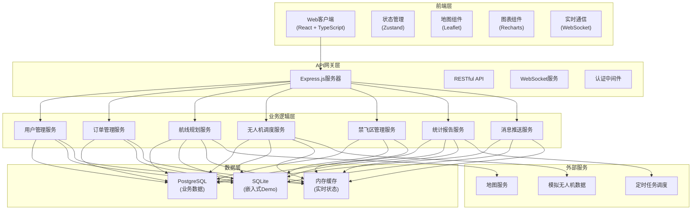
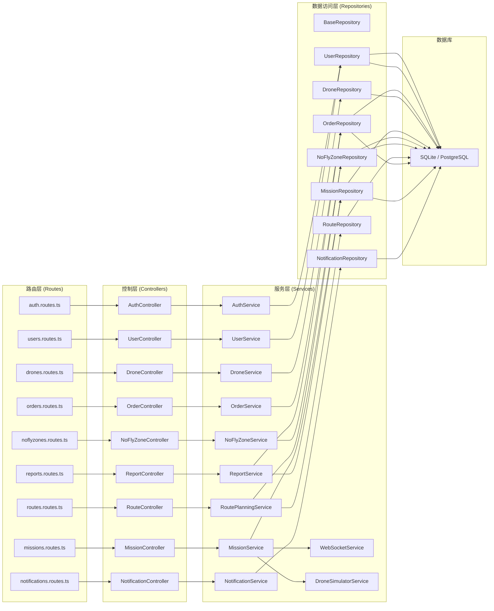
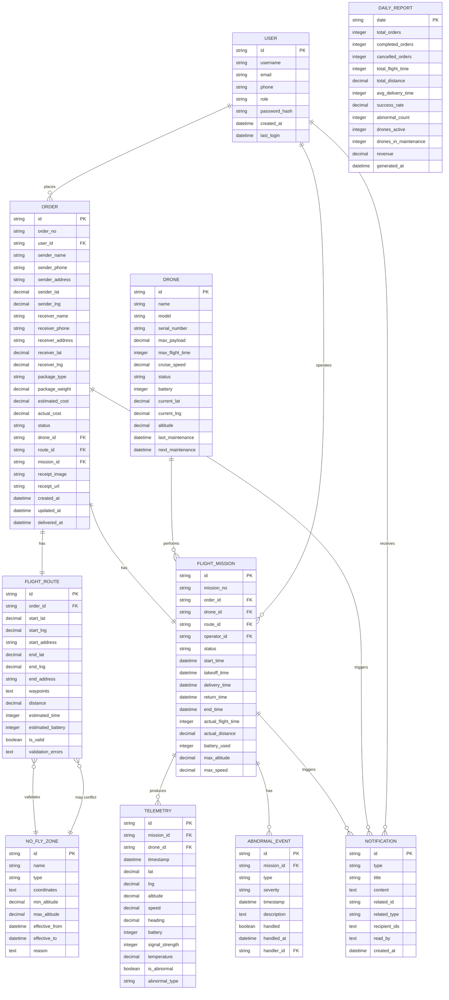

# 无人机快递配送调度平台 - 技术架构文档

## 1. 架构设计



## 2. 技术描述

### 2.1 技术栈选型

| 层级 | 技术选型 | 版本 | 说明 |
|------|----------|------|------|
| 前端框架 | React | 18.x | 组件化开发，虚拟DOM |
| 前端语言 | TypeScript | 5.x | 类型安全，提升可维护性 |
| 构建工具 | Vite | 5.x | 快速构建，热更新 |
| 样式方案 | Tailwind CSS | 3.x | 原子化CSS，快速开发 |
| 状态管理 | Zustand | 4.x | 轻量级状态管理 |
| 路由管理 | React Router | 6.x | 单页路由 |
| UI图标 | Lucide React | 最新 | 线性图标库 |
| 地图组件 | Leaflet | 1.9.x | 开源地图组件 |
| 图表组件 | Recharts | 2.x | React图表库 |
| 后端框架 | Express.js | 4.x | 轻量级Web框架 |
| 后端语言 | TypeScript | 5.x | 前后端类型一致 |
| 数据库 | SQLite | 3.x | 嵌入式数据库，Demo演示 |
| 实时通信 | WebSocket | - | 浏览器原生支持 |
| HTTP客户端 | Fetch API | - | 浏览器原生 |

### 2.2 项目初始化

- **项目类型**：Full-stack React + Express + TypeScript
- **包管理器**：pnpm（优先）/ npm
- **初始化命令**：
  ```bash
  pnpm create vite-init@latest . --template react-express-ts --force
  ```

## 3. 路由定义

### 3.1 前端路由

| 路由路径 | 页面名称 | 访问角色 | 说明 |
|----------|----------|----------|------|
| `/login` | 登录页 | 所有 | 角色选择登录 |
| `/` | 用户首页 | 用户 | 快速下单入口 |
| `/order/create` | 创建订单 | 用户 | 下单页面 |
| `/orders` | 订单列表 | 用户 | 我的订单 |
| `/orders/:id` | 订单详情 | 用户/操作员/调度员 | 订单信息、物流轨迹 |
| `/operator/drones` | 无人机管理 | 操作员 | 无人机列表和状态 |
| `/operator/missions` | 任务列表 | 操作员 | 待执行和进行中的任务 |
| `/operator/control/:missionId` | 飞行控制 | 操作员 | 实时监控和操作 |
| `/dispatcher/dashboard` | 调度中心 | 调度员 | 全局监控面板 |
| `/dispatcher/reports` | 统计报告 | 调度员 | 运力统计报表 |
| `/admin/users` | 用户管理 | 管理员 | 用户CRUD操作 |
| `/admin/no-fly-zones` | 禁飞区管理 | 管理员 | 禁飞区配置 |
| `/admin/settings` | 系统设置 | 管理员 | 系统参数配置 |

### 3.2 API 路由

| Method | 路径 | 模块 | 说明 |
|--------|------|------|------|
| POST | `/api/auth/login` | 认证 | 用户登录 |
| POST | `/api/auth/logout` | 认证 | 用户登出 |
| GET | `/api/auth/me` | 认证 | 获取当前用户 |
| GET | `/api/users` | 用户管理 | 用户列表 |
| POST | `/api/users` | 用户管理 | 创建用户 |
| PUT | `/api/users/:id` | 用户管理 | 更新用户 |
| DELETE | `/api/users/:id` | 用户管理 | 删除用户 |
| GET | `/api/orders` | 订单管理 | 订单列表 |
| POST | `/api/orders` | 订单管理 | 创建订单 |
| GET | `/api/orders/:id` | 订单管理 | 订单详情 |
| PUT | `/api/orders/:id/status` | 订单管理 | 更新订单状态 |
| GET | `/api/orders/:id/receipt` | 订单管理 | 下载签收凭证 |
| GET | `/api/drones` | 无人机管理 | 无人机列表 |
| POST | `/api/drones` | 无人机管理 | 添加无人机 |
| PUT | `/api/drones/:id` | 无人机管理 | 更新无人机信息 |
| GET | `/api/drones/:id/status` | 无人机管理 | 无人机实时状态 |
| GET | `/api/missions` | 任务管理 | 任务列表 |
| POST | `/api/missions/:id/takeoff` | 任务管理 | 一键起飞 |
| POST | `/api/missions/:id/return` | 任务管理 | 返航 |
| POST | `/api/missions/:id/emergency-land` | 任务管理 | 紧急降落 |
| GET | `/api/missions/:id/telemetry` | 任务管理 | 实时遥测数据(WS) |
| GET | `/api/no-fly-zones` | 禁飞区管理 | 禁飞区列表 |
| POST | `/api/no-fly-zones` | 禁飞区管理 | 创建禁飞区 |
| PUT | `/api/no-fly-zones/:id` | 禁飞区管理 | 更新禁飞区 |
| DELETE | `/api/no-fly-zones/:id` | 禁飞区管理 | 删除禁飞区 |
| POST | `/api/routes/plan` | 航线规划 | 规划最优航线 |
| POST | `/api/routes/validate` | 航线规划 | 航线合法性校验 |
| GET | `/api/reports/daily` | 统计报告 | 每日运力统计 |
| GET | `/api/notifications` | 消息推送 | 消息列表 |
| PUT | `/api/notifications/:id/read` | 消息推送 | 标记已读 |
| GET | `/api/ws/notifications` | 消息推送 | WebSocket实时消息 |

## 4. API 类型定义

```typescript
// 共享类型定义
export type UserRole = 'user' | 'operator' | 'dispatcher' | 'admin';
export type OrderStatus = 'pending' | 'assigned' | 'flying' | 'delivered' | 'returning' | 'completed' | 'cancelled' | 'error';
export type DroneStatus = 'idle' | 'charging' | 'ready' | 'flying' | 'returning' | 'maintenance' | 'error';
export type NotificationType = 'order_created' | 'flight_abnormal' | 'mission_completed' | 'system_alert';

// 用户接口
export interface User {
  id: string;
  username: string;
  email: string;
  phone: string;
  role: UserRole;
  avatar?: string;
  createdAt: Date;
  lastLogin?: Date;
}

// 无人机接口
export interface Drone {
  id: string;
  name: string;
  model: string;
  serialNumber: string;
  maxPayload: number; // kg
  maxFlightTime: number; // minutes
  cruiseSpeed: number; // m/s
  status: DroneStatus;
  battery: number; // 0-100
  currentLat?: number;
  currentLng?: number;
  altitude?: number;
  lastMaintenance?: Date;
  nextMaintenance?: Date;
}

// 禁飞区接口
export interface NoFlyZone {
  id: string;
  name: string;
  type: 'restricted' | 'warning' | 'forbidden';
  coordinates: { lat: number; lng: number }[];
  minAltitude: number;
  maxAltitude: number;
  effectiveFrom?: Date;
  effectiveTo?: Date;
  reason: string;
}

// 航线接口
export interface FlightRoute {
  id: string;
  orderId: string;
  startPoint: { lat: number; lng: number; address: string };
  endPoint: { lat: number; lng: number; address: string };
  waypoints: { lat: number; lng: number; altitude: number }[];
  distance: number; // meters
  estimatedTime: number; // seconds
  estimatedBattery: number; // percentage
  isValid: boolean;
  validationErrors?: string[];
}

// 订单接口
export interface Order {
  id: string;
  orderNo: string;
  userId: string;
  senderName: string;
  senderPhone: string;
  senderAddress: string;
  senderLat: number;
  senderLng: number;
  receiverName: string;
  receiverPhone: string;
  receiverAddress: string;
  receiverLat: number;
  receiverLng: number;
  packageType: string;
  packageWeight: number; // kg
  packageSize: { length: number; width: number; height: number };
  estimatedCost: number;
  actualCost?: number;
  status: OrderStatus;
  droneId?: string;
  routeId?: string;
  missionId?: string;
  receiptImage?: string;
  receiptUrl?: string;
  remark?: string;
  createdAt: Date;
  updatedAt: Date;
  deliveredAt?: Date;
}

// 飞行任务接口
export interface FlightMission {
  id: string;
  missionNo: string;
  orderId: string;
  droneId: string;
  routeId: string;
  operatorId?: string;
  status: 'pending' | 'ready' | 'flying' | 'delivered' | 'returning' | 'completed' | 'aborted';
  startTime?: Date;
  endTime?: Date;
  takeoffTime?: Date;
  deliveryTime?: Date;
  returnTime?: Date;
  actualFlightTime?: number;
  actualDistance?: number;
  batteryUsed?: number;
  maxAltitude?: number;
  maxSpeed?: number;
  abnormalEvents?: AbnormalEvent[];
}

// 遥测数据接口
export interface TelemetryData {
  timestamp: Date;
  droneId: string;
  missionId: string;
  lat: number;
  lng: number;
  altitude: number;
  speed: number;
  heading: number;
  battery: number;
  signalStrength: number;
  temperature: number;
  isAbnormal: boolean;
  abnormalType?: string;
}

// 异常事件接口
export interface AbnormalEvent {
  id: string;
  missionId: string;
  type: 'low_battery' | 'signal_lost' | 'weather' | 'collision_risk' | 'system_error' | 'no_fly_zone';
  severity: 'warning' | 'critical';
  timestamp: Date;
  description: string;
  handled: boolean;
  handledAt?: Date;
  handlerId?: string;
}

// 通知接口
export interface Notification {
  id: string;
  type: NotificationType;
  title: string;
  content: string;
  relatedId?: string;
  relatedType?: string;
  recipientIds: string[];
  readBy: string[];
  createdAt: Date;
}

// 统计报告接口
export interface DailyReport {
  date: string;
  totalOrders: number;
  completedOrders: number;
  cancelledOrders: number;
  totalFlightTime: number;
  totalDistance: number;
  avgDeliveryTime: number;
  successRate: number;
  abnormalCount: number;
  dronesActive: number;
  dronesInMaintenance: number;
  revenue: number;
}
```

## 5. 服务端架构图



## 6. 数据模型

### 6.1 ER 图



### 6.2 DDL 语句 (SQLite)

```sql
-- 用户表
CREATE TABLE IF NOT EXISTS users (
    id TEXT PRIMARY KEY,
    username TEXT NOT NULL UNIQUE,
    email TEXT NOT NULL UNIQUE,
    phone TEXT NOT NULL,
    role TEXT NOT NULL CHECK (role IN ('user', 'operator', 'dispatcher', 'admin')),
    password_hash TEXT NOT NULL,
    avatar TEXT,
    created_at DATETIME DEFAULT CURRENT_TIMESTAMP,
    last_login DATETIME
);

-- 无人机表
CREATE TABLE IF NOT EXISTS drones (
    id TEXT PRIMARY KEY,
    name TEXT NOT NULL,
    model TEXT NOT NULL,
    serial_number TEXT NOT NULL UNIQUE,
    max_payload REAL NOT NULL,
    max_flight_time INTEGER NOT NULL,
    cruise_speed REAL NOT NULL,
    status TEXT NOT NULL DEFAULT 'idle' CHECK (status IN ('idle', 'charging', 'ready', 'flying', 'returning', 'maintenance', 'error')),
    battery INTEGER NOT NULL DEFAULT 100,
    current_lat REAL,
    current_lng REAL,
    altitude REAL,
    last_maintenance DATETIME,
    next_maintenance DATETIME,
    created_at DATETIME DEFAULT CURRENT_TIMESTAMP
);

-- 订单表
CREATE TABLE IF NOT EXISTS orders (
    id TEXT PRIMARY KEY,
    order_no TEXT NOT NULL UNIQUE,
    user_id TEXT NOT NULL,
    sender_name TEXT NOT NULL,
    sender_phone TEXT NOT NULL,
    sender_address TEXT NOT NULL,
    sender_lat REAL NOT NULL,
    sender_lng REAL NOT NULL,
    receiver_name TEXT NOT NULL,
    receiver_phone TEXT NOT NULL,
    receiver_address TEXT NOT NULL,
    receiver_lat REAL NOT NULL,
    receiver_lng REAL NOT NULL,
    package_type TEXT NOT NULL,
    package_weight REAL NOT NULL,
    package_length REAL,
    package_width REAL,
    package_height REAL,
    estimated_cost REAL NOT NULL,
    actual_cost REAL,
    status TEXT NOT NULL DEFAULT 'pending' CHECK (status IN ('pending', 'assigned', 'flying', 'delivered', 'returning', 'completed', 'cancelled', 'error')),
    drone_id TEXT,
    route_id TEXT,
    mission_id TEXT,
    receipt_image TEXT,
    receipt_url TEXT,
    remark TEXT,
    created_at DATETIME DEFAULT CURRENT_TIMESTAMP,
    updated_at DATETIME DEFAULT CURRENT_TIMESTAMP,
    delivered_at DATETIME,
    FOREIGN KEY (user_id) REFERENCES users(id),
    FOREIGN KEY (drone_id) REFERENCES drones(id)
);

-- 航线表
CREATE TABLE IF NOT EXISTS flight_routes (
    id TEXT PRIMARY KEY,
    order_id TEXT NOT NULL UNIQUE,
    start_lat REAL NOT NULL,
    start_lng REAL NOT NULL,
    start_address TEXT NOT NULL,
    end_lat REAL NOT NULL,
    end_lng REAL NOT NULL,
    end_address TEXT NOT NULL,
    waypoints TEXT NOT NULL,
    distance REAL NOT NULL,
    estimated_time INTEGER NOT NULL,
    estimated_battery INTEGER NOT NULL,
    is_valid BOOLEAN NOT NULL DEFAULT 1,
    validation_errors TEXT,
    created_at DATETIME DEFAULT CURRENT_TIMESTAMP,
    FOREIGN KEY (order_id) REFERENCES orders(id)
);

-- 飞行任务表
CREATE TABLE IF NOT EXISTS flight_missions (
    id TEXT PRIMARY KEY,
    mission_no TEXT NOT NULL UNIQUE,
    order_id TEXT NOT NULL UNIQUE,
    drone_id TEXT NOT NULL,
    route_id TEXT NOT NULL,
    operator_id TEXT,
    status TEXT NOT NULL DEFAULT 'pending' CHECK (status IN ('pending', 'ready', 'flying', 'delivered', 'returning', 'completed', 'aborted')),
    start_time DATETIME,
    takeoff_time DATETIME,
    delivery_time DATETIME,
    return_time DATETIME,
    end_time DATETIME,
    actual_flight_time INTEGER,
    actual_distance REAL,
    battery_used INTEGER,
    max_altitude REAL,
    max_speed REAL,
    created_at DATETIME DEFAULT CURRENT_TIMESTAMP,
    FOREIGN KEY (order_id) REFERENCES orders(id),
    FOREIGN KEY (drone_id) REFERENCES drones(id),
    FOREIGN KEY (route_id) REFERENCES flight_routes(id),
    FOREIGN KEY (operator_id) REFERENCES users(id)
);

-- 遥测数据表
CREATE TABLE IF NOT EXISTS telemetry (
    id TEXT PRIMARY KEY,
    mission_id TEXT NOT NULL,
    drone_id TEXT NOT NULL,
    timestamp DATETIME DEFAULT CURRENT_TIMESTAMP,
    lat REAL NOT NULL,
    lng REAL NOT NULL,
    altitude REAL NOT NULL,
    speed REAL NOT NULL,
    heading REAL NOT NULL,
    battery INTEGER NOT NULL,
    signal_strength INTEGER NOT NULL,
    temperature REAL NOT NULL,
    is_abnormal BOOLEAN NOT NULL DEFAULT 0,
    abnormal_type TEXT,
    FOREIGN KEY (mission_id) REFERENCES flight_missions(id),
    FOREIGN KEY (drone_id) REFERENCES drones(id)
);

-- 异常事件表
CREATE TABLE IF NOT EXISTS abnormal_events (
    id TEXT PRIMARY KEY,
    mission_id TEXT NOT NULL,
    type TEXT NOT NULL CHECK (type IN ('low_battery', 'signal_lost', 'weather', 'collision_risk', 'system_error', 'no_fly_zone')),
    severity TEXT NOT NULL CHECK (severity IN ('warning', 'critical')),
    timestamp DATETIME DEFAULT CURRENT_TIMESTAMP,
    description TEXT NOT NULL,
    handled BOOLEAN NOT NULL DEFAULT 0,
    handled_at DATETIME,
    handler_id TEXT,
    FOREIGN KEY (mission_id) REFERENCES flight_missions(id),
    FOREIGN KEY (handler_id) REFERENCES users(id)
);

-- 禁飞区表
CREATE TABLE IF NOT EXISTS no_fly_zones (
    id TEXT PRIMARY KEY,
    name TEXT NOT NULL,
    type TEXT NOT NULL CHECK (type IN ('restricted', 'warning', 'forbidden')),
    coordinates TEXT NOT NULL,
    min_altitude REAL NOT NULL DEFAULT 0,
    max_altitude REAL NOT NULL,
    effective_from DATETIME,
    effective_to DATETIME,
    reason TEXT,
    created_at DATETIME DEFAULT CURRENT_TIMESTAMP
);

-- 通知表
CREATE TABLE IF NOT EXISTS notifications (
    id TEXT PRIMARY KEY,
    type TEXT NOT NULL CHECK (type IN ('order_created', 'flight_abnormal', 'mission_completed', 'system_alert')),
    title TEXT NOT NULL,
    content TEXT NOT NULL,
    related_id TEXT,
    related_type TEXT,
    recipient_ids TEXT NOT NULL,
    read_by TEXT NOT NULL DEFAULT '[]',
    created_at DATETIME DEFAULT CURRENT_TIMESTAMP
);

-- 日报表
CREATE TABLE IF NOT EXISTS daily_reports (
    date TEXT PRIMARY KEY,
    total_orders INTEGER NOT NULL DEFAULT 0,
    completed_orders INTEGER NOT NULL DEFAULT 0,
    cancelled_orders INTEGER NOT NULL DEFAULT 0,
    total_flight_time INTEGER NOT NULL DEFAULT 0,
    total_distance REAL NOT NULL DEFAULT 0,
    avg_delivery_time INTEGER NOT NULL DEFAULT 0,
    success_rate REAL NOT NULL DEFAULT 0,
    abnormal_count INTEGER NOT NULL DEFAULT 0,
    drones_active INTEGER NOT NULL DEFAULT 0,
    drones_in_maintenance INTEGER NOT NULL DEFAULT 0,
    revenue REAL NOT NULL DEFAULT 0,
    generated_at DATETIME DEFAULT CURRENT_TIMESTAMP
);

-- 索引
CREATE INDEX IF NOT EXISTS idx_orders_user_id ON orders(user_id);
CREATE INDEX IF NOT EXISTS idx_orders_status ON orders(status);
CREATE INDEX IF NOT EXISTS idx_orders_created_at ON orders(created_at);
CREATE INDEX IF NOT EXISTS idx_missions_drone_id ON flight_missions(drone_id);
CREATE INDEX IF NOT EXISTS idx_missions_status ON flight_missions(status);
CREATE INDEX IF NOT EXISTS idx_telemetry_mission_id ON telemetry(mission_id);
CREATE INDEX IF NOT EXISTS idx_telemetry_timestamp ON telemetry(timestamp);
CREATE INDEX IF NOT EXISTS idx_notifications_created_at ON notifications(created_at);
```

### 6.3 初始化数据

```sql
-- 默认管理员账号 (密码: admin123)
INSERT OR IGNORE INTO users (id, username, email, phone, role, password_hash) VALUES 
('admin-001', 'admin', 'admin@drone-delivery.com', '13800138000', 'admin', '$2b$10$N9qo8uLOickgx2ZMRZoMyeIjZAgcfl7p92ldGxad68LJZdL17lhWy');

-- 默认操作员账号 (密码: operator123)
INSERT OR IGNORE INTO users (id, username, email, phone, role, password_hash) VALUES 
('op-001', 'operator1', 'operator1@drone-delivery.com', '13800138001', 'operator', '$2b$10$N9qo8uLOickgx2ZMRZoMyeIjZAgcfl7p92ldGxad68LJZdL17lhWy'),
('op-002', 'operator2', 'operator2@drone-delivery.com', '13800138002', 'operator', '$2b$10$N9qo8uLOickgx2ZMRZoMyeIjZAgcfl7p92ldGxad68LJZdL17lhWy');

-- 默认调度员账号 (密码: dispatcher123)
INSERT OR IGNORE INTO users (id, username, email, phone, role, password_hash) VALUES 
('disp-001', 'dispatcher', 'dispatcher@drone-delivery.com', '13800138003', 'dispatcher', '$2b$10$N9qo8uLOickgx2ZMRZoMyeIjZAgcfl7p92ldGxad68LJZdL17lhWy');

-- 默认用户账号 (密码: user123)
INSERT OR IGNORE INTO users (id, username, email, phone, role, password_hash) VALUES 
('user-001', 'testuser', 'user@drone-delivery.com', '13800138004', 'user', '$2b$10$N9qo8uLOickgx2ZMRZoMyeIjZAgcfl7p92ldGxad68LJZdL17lhWy');

-- 初始化无人机数据
INSERT OR IGNORE INTO drones (id, name, model, serial_number, max_payload, max_flight_time, cruise_speed, status, battery) VALUES 
('drone-001', '飞翼-001', 'DJI Matrice 300 RTK', 'SN-DJI-2024-001', 2.7, 55, 15, 'ready', 95),
('drone-002', '飞翼-002', 'DJI Matrice 300 RTK', 'SN-DJI-2024-002', 2.7, 55, 15, 'ready', 88),
('drone-003', '飞翼-003', 'DJI Mavic 3 Enterprise', 'SN-DJI-2024-003', 0.8, 45, 12, 'charging', 45),
('drone-004', '飞翼-004', 'DJI Matrice 300 RTK', 'SN-DJI-2024-004', 2.7, 55, 15, 'ready', 100),
('drone-005', '飞翼-005', 'DJI Mavic 3 Enterprise', 'SN-DJI-2024-005', 0.8, 45, 12, 'maintenance', 60);

-- 初始化禁飞区数据 (北京市中心区域示例)
INSERT OR IGNORE INTO no_fly_zones (id, name, type, coordinates, min_altitude, max_altitude, reason) VALUES 
('nfz-001', '首都机场禁飞区', 'forbidden', 
 '[{"lat":40.0801,"lng":116.5846},{"lat":40.0801,"lng":116.6446},{"lat":40.0401,"lng":116.6446},{"lat":40.0401,"lng":116.5846}]',
 0, 120, '机场核心禁飞区'),
('nfz-002', '天安门广场限制区', 'restricted',
 '[{"lat":39.9187,"lng":116.3915},{"lat":39.9187,"lng":116.4075},{"lat":39.9027,"lng":116.4075},{"lat":39.9027,"lng":116.3915}]',
 0, 30, '敏感区域低空限制'),
('nfz-003', '城市公园警告区', 'warning',
 '[{"lat":39.9999,"lng":116.2755},{"lat":39.9999,"lng":116.3055},{"lat":39.9799,"lng":116.3055},{"lat":39.9799,"lng":116.2755}]',
 0, 60, '人员密集区域');
```
